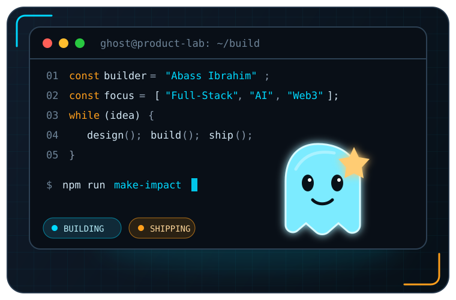

<!--
  Profile README for github.com/Lingz450
  Built around Abass's real projects, skills, and current work.
-->

  

<h1 align="center">👨🏾‍💻 Hi, I'm Abass Ibrahim — a Full-Stack Developer from Lagos.</h1>

  I turn ambitious ideas into fast, thoughtful, production-ready digital products.

  
  
  
  

---

## A little about Ghost

- 🔭 I ship **full-stack products**, from first wireframe to production.
- 🤖 I'm building **AI assistants, automation systems, and intelligent dashboards**.
- 🌱 I'm sharpening my skills in **agentic AI, scalable architecture, and product engineering**.
- 👯 I'm open to collaborating on **SaaS, Web3, AI, and high-impact open-source tools**.
- 💬 Ask me about **React, Next.js, TypeScript, Tailwind CSS, UI/UX, or shipping MVPs**.
- 🛠️ I also work in **IT support for oil & gas operations**, keeping critical systems reliable.
- ⚡ I care about clean interfaces, maintainable code, and products people can actually use.
- 📫 Reach me at **[abassibrahim591@gmail.com](mailto:abassibrahim591@gmail.com)**.

 

## Featured builds

<table>
  <tr>
    <td width="50%" valign="top">
      <h3>📈 <a href="https://thethesisdesk.xyz">The Thesis Desk</a></h3>
      
Real-time crypto trading command center, journal, analytics, education, and accountability for a 500+ member community.

      
<strong>Next.js · TypeScript · PostgreSQL · Prisma · WebSockets</strong>

      <a href="https://github.com/Trust-Code-System/Ghost-Trading-Academy">Source</a> ·
      <a href="https://thethesisdesk.xyz">Live product</a>
    </td>
    <td width="50%" valign="top">
      <h3>🎓 <a href="https://helpingtribeacademy.com">Helping Tribe Academy</a></h3>
      
Multi-portal learning platform with distinct student, facilitator, and administrator experiences.

      
<strong>Next.js · TypeScript · Tailwind CSS · Role-based auth</strong>

      <a href="https://github.com/Idansss/Helping-Tribe">Source</a> ·
      <a href="https://helpingtribeacademy.com">Live product</a>
    </td>
  </tr>
  <tr>
    <td width="50%" valign="top">
      <h3>💎 <a href="https://wearables-atelier.vercel.app">Wearables Atelier</a></h3>
      
Premium Nigerian womenswear storefront with editorial presentation, rich collections, and wholesale flows.

      
<strong>Next.js · TypeScript · Tailwind CSS · E-commerce</strong>

      <a href="https://github.com/Idansss/Wearables-Atelier">Source</a> ·
      <a href="https://wearables-atelier.vercel.app">Live product</a>
    </td>
    <td width="50%" valign="top">
      <h3>🛢️ <a href="https://petro-brain-web.vercel.app">PetroBrain Web</a></h3>
      
AI-native oil and gas intelligence interface with source-citing answers, engineering decision support, and geospatial workflows.

      
<strong>Next.js · TypeScript · React Query · MapLibre · Neon</strong>

      <a href="https://github.com/Trust-Code-System/PetroBrainWeb">Source</a> ·
      <a href="https://petro-brain-web.vercel.app">Live product</a>
    </td>
  </tr>
  <tr>
    <td width="50%" valign="top">
      <h3>🧠 <a href="https://github.com/Trust-Code-System/PetroBrain">PetroBrain</a></h3>
      
Safety-first oil and gas AI backend with cited RAG, deterministic engineering calculations, and NUPRC Tier-3 MRV.

      
<strong>Python · FastAPI · PostgreSQL · Redis · RAG</strong>

      <a href="https://github.com/Trust-Code-System/PetroBrain">Source</a> ·
      <a href="https://petro-brain-web.vercel.app">Live platform</a>
    </td>
    <td width="50%" valign="top">
      <h3>🌍 <a href="https://atlas-hr-fq24.vercel.app">AtlasHR</a></h3>
      
Global HR, payroll, onboarding, and AI compliance platform built for teams operating across Nigeria, India, the UK, and the US.

      
<strong>Next.js · TypeScript · Supabase · Stripe · AI</strong>

      <a href="https://github.com/Trust-Code-System/Atlas-HR">Source</a> ·
      <a href="https://atlas-hr-fq24.vercel.app">Live product</a>
    </td>
  </tr>
</table>

## Technologies I build with

### Frontend and product

### Backend, data, and delivery

## GitHub pulse

  
  

  

<picture>
  <source
    media="(prefers-color-scheme: dark)"
    srcset="https://raw.githubusercontent.com/Lingz450/Lingz450/output/github-contribution-grid-snake-dark.svg"
  />
  <source
    media="(prefers-color-scheme: light)"
    srcset="https://raw.githubusercontent.com/Lingz450/Lingz450/output/github-contribution-grid-snake.svg"
  />
  
</picture>

---

  <strong>From Lagos, building for the world.</strong>
   
  Clean code. Thoughtful design. Real products.

