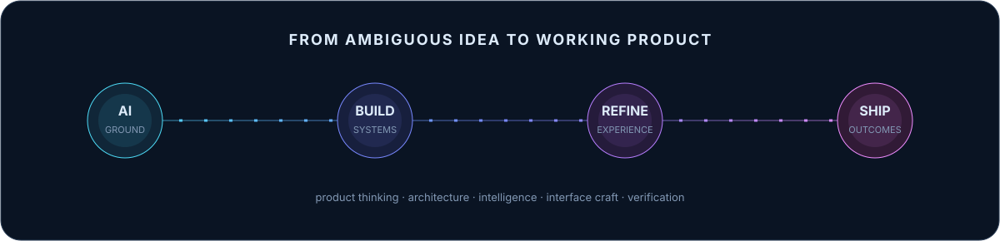

  

<h1 align="center">Abass Ibrahim</h1>

  <strong>Full-Stack &amp; AI Product Engineer</strong> 
  I design and ship intelligent software, business platforms, AI agents, commerce systems, and immersive web experiences.

  Lagos, Nigeria &nbsp;·&nbsp; Co-leading
  <a href="https://trustcodesystem.tech"><strong>TrustCode System Limited</strong></a>

  <a href="https://abassibrahim.xyz">Portfolio</a>
  &nbsp;·&nbsp;
  <a href="https://github.com/Trust-Code-System">TrustCode engineering</a>
  &nbsp;·&nbsp;
  <a href="https://www.linkedin.com/in/abass-ibrahim-6a5795194/">LinkedIn</a>
  &nbsp;·&nbsp;
  <a href="mailto:abassibrahim591@gmail.com">Email</a>

## Building now

<table>
  <tr>
    <td width="50%" valign="top">
      <strong>AI workspaces and agents</strong> 
      Private, source-grounded assistants with retrieval, citations, memory, research, and user-controlled automation.
    </td>
    <td width="50%" valign="top">
      <strong>Commerce and operations</strong> 
      Art-first storefronts, administration systems, inventory, payments, background jobs, and customer-facing AI.
    </td>
  </tr>
  <tr>
    <td width="50%" valign="top">
      <strong>Production business platforms</strong> 
      Full-stack tools for knowledge, HR, analytics, decision support, and dependable internal workflows.
    </td>
    <td width="50%" valign="top">
      <strong>Immersive interfaces</strong> 
      High-craft product experiences using motion, 3D scenes, responsive systems, and accessible interaction design.
    </td>
  </tr>
</table>

  

## Flagship work

<table>
  <tr>
    <td width="50%" valign="top">
      <h3><a href="https://aria-vert-chi.vercel.app">Aria</a></h3>
      
<strong>Privacy-first AI Chief of Staff and Second Brain.</strong> A source-grounded workspace for chat, knowledge, cited research, controlled memory, and report generation.

      
<code>Next.js</code> <code>TypeScript</code> <code>Supabase</code> <code>pgvector</code> <code>RAG</code>

      
<a href="https://github.com/Trust-Code-System/Aria">Source</a> · <a href="https://aria-vert-chi.vercel.app">Live preview</a> · <strong>MVP</strong>

    </td>
    <td width="50%" valign="top">
      <h3><a href="https://github.com/Idansss/Tai">F.A.T.U / Tai Manic Studios</a></h3>
      
<strong>Art-first commerce platform.</strong> A storefront, garment design studio, admin system, modular API, media pipeline, and background workers built collaboratively.

      
<code>Next.js</code> <code>NestJS</code> <code>Prisma</code> <code>Redis</code> <code>BullMQ</code>

      
<a href="https://github.com/Idansss/Tai">Source</a> · <a href="https://tai-admin.vercel.app">Admin preview</a> · <strong>Active development</strong>

    </td>
  </tr>
  <tr>
    <td width="50%" valign="top">
      <h3><a href="https://9thluxe-store.vercel.app">9thluxe Store</a></h3>
      
<strong>Editorial perfume commerce.</strong> A storefront and operational platform with admin controls, provider abstractions, checkout flows, and an AI concierge.

      
<code>Next.js</code> <code>TypeScript</code> <code>Commerce</code> <code>AI</code>

      
<a href="https://github.com/Trust-Code-System/9thluxe-store">Source</a> · <a href="https://9thluxe-store.vercel.app">Live preview</a> · <strong>Active development</strong>

    </td>
    <td width="50%" valign="top">
      <h3><a href="https://petro-brain-web.vercel.app">PetroBrain</a></h3>
      
<strong>Source-citing AI decision support.</strong> A safety-focused RAG backend and web interface with deterministic engineering calculations and hardened operational workflows.

      
<code>Python</code> <code>FastAPI</code> <code>Next.js</code> <code>PostgreSQL</code> <code>RAG</code>

      
<a href="https://github.com/Trust-Code-System/PetroBrain">API</a> · <a href="https://github.com/Trust-Code-System/PetroBrainWeb">Web</a> · <a href="https://petro-brain-web.vercel.app">Live preview</a>

    </td>
  </tr>
  <tr>
    <td width="50%" valign="top">
      <h3><a href="https://thethesisdesk.xyz">The Thesis Desk</a></h3>
      
<strong>Crypto trading command center.</strong> Real-time market workflows, journaling, analytics, education, and accountability in one focused product.

      
<code>Next.js</code> <code>TypeScript</code> <code>Prisma</code> <code>WebSockets</code>

      
<a href="https://github.com/Trust-Code-System/Ghost-Trading-Academy">Source</a> · <a href="https://thethesisdesk.xyz">Live product</a>

    </td>
    <td width="50%" valign="top">
      <h3><a href="https://github.com/Lingz450/abass-world">Abass World</a></h3>
      
<strong>Immersive 3D portfolio experiment.</strong> A personal world built around real-time scenes, motion, post-processing, and stateful interaction.

      
<code>Next.js</code> <code>Three.js</code> <code>React Three Fiber</code> <code>Framer Motion</code>

      
<a href="https://github.com/Lingz450/abass-world">Source</a> · <strong>In development</strong>

    </td>
  </tr>
</table>

## What I bring to a product

- **AI products and intelligent workflows** — source-grounded assistants, RAG, embeddings, vector search, memory, tool integrations, and evaluation-minded delivery.
- **Full-stack platforms** — product architecture, authentication, APIs, databases, dashboards, background workers, integrations, and deployment.
- **Commerce and operations** — catalogues, design tools, carts, checkout, payments, inventory, admin control, and automation.
- **Premium experience design** — responsive systems, design direction, interaction, motion, Three.js, accessibility, and interface refinement.
- **Production readiness** — validation, secure defaults, observability, documentation, testing, and clear operational handoff.

## Selected toolkit

  

| Area | Technologies used in current work |
| --- | --- |
| Product interfaces | TypeScript, React, Next.js, Tailwind CSS, Framer Motion, Three.js, React Three Fiber, Zustand, TanStack Query |
| APIs and architecture | Node.js, NestJS, FastAPI, tRPC, REST, WebSockets, Turborepo, background workers |
| Data and infrastructure | PostgreSQL, Supabase, Prisma, Drizzle, Redis, BullMQ, pgvector, S3-compatible storage, Docker |
| AI systems | OpenAI, Anthropic, Vercel AI SDK, RAG, embeddings, vector search, cited assistants, agent workflows |
| Delivery and quality | GitHub Actions, Vercel, Vitest, Playwright, React Testing Library, Zod, security-focused review |

## How I work

I combine product thinking, engineering, and interface judgment to move from ambiguous idea to working system. I prefer maintainable architecture, explicit trade-offs, testable claims, privacy-aware defaults, and documentation that helps the next person operate the product—not just admire the code.

  

## GitHub activity

<picture>
  <source media="(prefers-color-scheme: dark)" srcset="https://raw.githubusercontent.com/Lingz450/Lingz450/output/github-contribution-grid-snake-dark.svg" />
  <source media="(prefers-color-scheme: light)" srcset="https://raw.githubusercontent.com/Lingz450/Lingz450/output/github-contribution-grid-snake.svg" />
  
</picture>

  <h2>Build the useful version.</h2>
  
Open to product engineering opportunities, selected builds, technical partnerships, and thoughtful collaborations.

  

    <a href="mailto:abassibrahim591@gmail.com?subject=Product%20engineering%20conversation"><strong>Start a conversation</strong></a>
    &nbsp;·&nbsp;
    <a href="https://abassibrahim.xyz"><strong>Explore my work</strong></a>
  

  Lagos, Nigeria · Building with TrustCode System Limited

